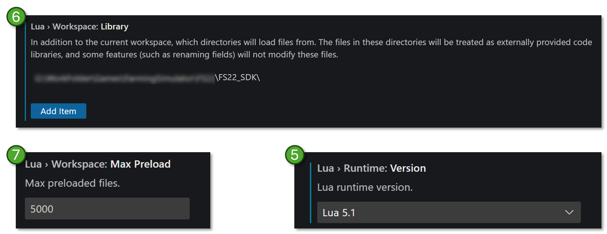
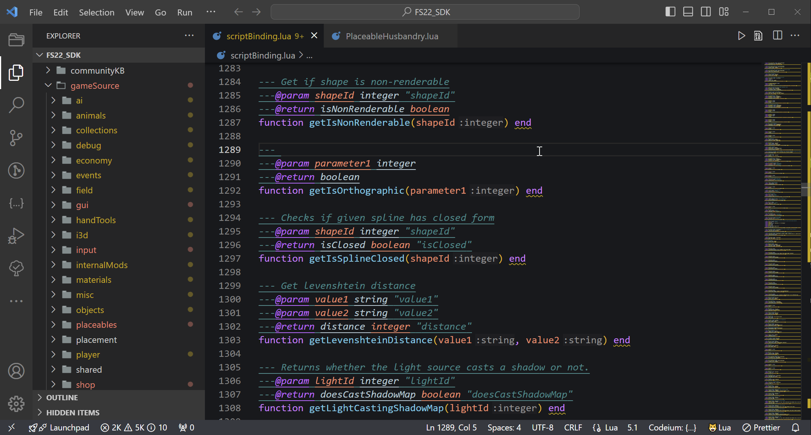
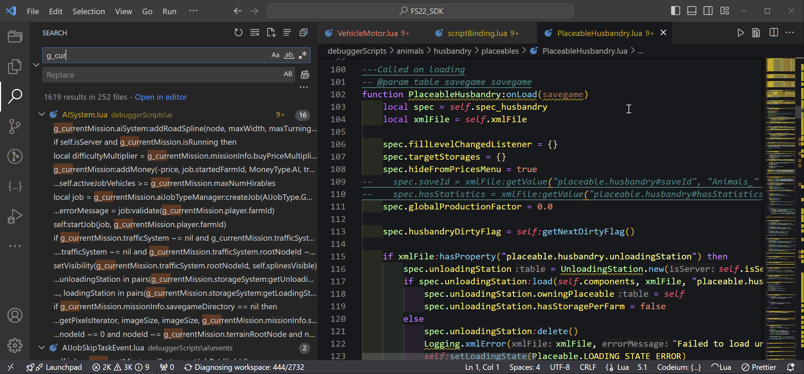

# 📚 Community SDK
This is our effort to bridge the gap between the official Giants Developer Network and the knowledge spread throughout the FS modding community. Sort of an FS modding knowledgebase and FS LUA Reference Library.

### Recommended resources:
- ⚙️ **[Script Library](https://github.com/open-modding-alliance/ScriptLibrary)** ([install](https://github.com/open-modding-alliance/ScriptLibrary?tab=readme-ov-file#installation) | documentation)
- 🧰 **FS Build tool** (install | documentation)
- 🎁 **[Bootstrap Mod](https://github.com/open-modding-alliance/BootstrapMod)** (download)

| Quick links | | |
|-------------|-|-|
| [🧙 Productivity tips & guides](https://github.com/open-modding-alliance/CommunitySDK?tab=readme-ov-file#-productivity-tips--guides) | [🛠️ Configure your IDE/text editor](https://github.com/open-modding-alliance/CommunitySDK?tab=readme-ov-file#%EF%B8%8F-configure-your-idetext-editor) | [🤖 Automation](https://github.com/open-modding-alliance/CommunitySDK?tab=readme-ov-file#-automation) |

## 📚 LUA Reference Library
<!-- 
- FS Lua Explained 
- Undocumented functions
- -->
  - [Script Bindings](ScriptBinding.md) ([download](https://raw.githubusercontent.com/open-modding-alliance/CommunitySDK/main/scriptBinding.lua)) 
  - [Can-I-Use-It?](https://github.com/open-modding-alliance/CommunitySDK?tab=readme-ov-file#-can-i-use-it-in-game-vs-giants-editor-vs-lua-stand-alone) _(in-game vs Giants Editor vs Lua stand-alone)_
  - Community KB (how-to/setup)
    - Global Tables
    - Global Functions
    - Known Classes
  - [Official GDN](https://gdn.giants-software.com/)
    - [FS LUA API Reference](https://gdn.giants-software.com/documentation_scripting_fs22.php)
    - [Video tutorials](https://gdn.giants-software.com/videoTutorials2.php)
  - [XML Schemas](https://validation.gdn.giants-software.com/xml/fs22/1.11.0.0/) (how-to/setup)

## 🧙 **Productivity tips & guides**

### ❓ [Can-I-Use-It?](Can-I-Use-It.md) _(in-game vs Giants Editor vs Lua stand-alone)_

Did you know that a lot of the in-game Lua code can be tested directly in the Giants editor or even directly via the stand-alone Lua interpreter? 

However, there are some limitations. E.g. some features are restricted by Giants due to security considerations, and some game specific core Lua functions are simply not available in the native Lua interpreter.

The [Can-I-Use-It?](Can-I-Use-It.md) page has a summary of which functions, classes and tables that might be available only in one, two or all three enviroments, sometimes only available with limited functionality.

### 🛠️ Configure your IDE/text editor
Tips and guides to make you more efficient when working with your mods, especially the XML and Lua parts. Choose the text editor you prefer, ideally one that supports all/most of the options below:

1. Install a Lua extension to provide intellisense and Lua language support
2. Install a Lua server extension to get context aware 
3. If your text editor lack advanced support for XML, it is recommended to install an XML extension as well
4. Configure your Lua extension to use Lua 5.1
5. Configure your language server to read source files from a custom folder, and in this folder you add relevant Lua files containing global tables, classes, script bindings etc what will help the language server understand the FS object model, e.g:
   1. ScriptBindings
   2. Global tables
   3. Known classes
   4. Undocumented functions
6. Install a extension to support Markdown
   1. Optionally: Install an extension to support Markdown TODO
7. If everything is setup properly you should now have intellisense suggesting `g_currentMission` when you type `g_cur`.

By configuring the editor with the right extensions and settings you set yourself up for maximum productivity where you can focus on the creative process.

#### Install recommended VS Code extensions
The following example assumes you are using VS Code (which we can truly recommend), however the most popular alternative text editor should have similar capabilties. 

Install the following extensions:
1. ['Lua' language server](https://marketplace.visualstudio.com/items?itemName=sumneko.lua)
2. [Lua snippets](https://marketplace.visualstudio.com/items?itemName=keyring.Lua) _[needs to be verified if still needed]_
3. [Lua for Visual Studio Code](https://marketplace.visualstudio.com/items?itemName=gccfeli.vscode-lua) _[needs to be verified if still needed]_
4. [XML](https://marketplace.visualstudio.com/items?itemName=redhat.vscode-xml)
   - Check the XML Schema section for details on how to use this extension optimally
5. _[optional]_ [Markdown All In One](https://marketplace.visualstudio.com/items?itemName=yzhang.markdown-all-in-one)
6. _[optional]_ [Markdown TODO](https://marketplace.visualstudio.com/items?itemName=fabiospampinato.vscode-markdown-todo)
7. _[optional]_ [TODO Highlight](https://marketplace.visualstudio.com/items?itemName=wayou.vscode-todo-highlight)
8. _[optional]_ [FS22 Snippets](https://marketplace.visualstudio.com/items?itemName=FSGModding.fs22-snippets) by FSG Modding
   - This extension might be redundant if the XML extension and proper XML Schemas is used
   - Possible (untested) alternative by [Razor Modding Team](https://marketplace.visualstudio.com/items?itemName=RazorModdingTeam.fs22-vscode-snippets)

#### Setup the Lua language server extension
The following assumes you completed the previous step of setting up VS Code with the Lua language server. 

1. Go to Extensions
2. Find `Lua` (language server from step 1 in the setup extensions guide)
3. Klick on the gear icon ⚙️
4. Choose `Extensions Settings`
5. Search for `Runtime Version` and select `5.1`
6.  Search for `Workspace Library` and add at least one folder where you will store your custom Lua API reference files. Recommended Lua files to add:
    - scriptBinding.lua
    - gameSource (extract the contents of `gameSource.zip` in the `sdk\debugger\` subfolder of your FS installation)
    - All files from the Community KB
7. _[optional]_ Search for `Max Preload` and choose a higher number (`5000` seems to work ok without requiring too much memory)
8. _[optional]_ Search for `Show Params` and enable it
9. _[optional]_ Search for `Hint`
   - `Hint: Enable` Enable 
   - `Hint: Param type` Enable 
   - `Hint: Set type` Enable 
10. _[optional]_ Review other extension settings based on your personal preferences
11. Done

**Note:** if you put all the different files from step 6 above in different subfolders, you can also open this folder as separate project in VS Code which makes it easy to search for functions, tables or files from your "SDK library", e.g:
 

### 🤖 Automation 
A great productivity tip is to use automation to streamline tedious tasks, this is a few examples:

- Automate the process of creating your zip archive using a single command in the terminal
- Automate the TestRunner tool automatically when building your zip archive
- Auto-start FS from your code eidtor with a pre-defined savegame that contains your dev/test setup
- Use a mod to enable you to restart current savegame directly from the game, either via the UI or the developer console
  - PowerTools provides both UI and console option, PowerTools Developer has the console option and EasyDevControls also provide the console option.
- In VS Code you can allocate keyboard shortcuts to custom commands, e.g. to create your zip or start FS with a specific savegame
- Use a AI tool such as Codeium or Copilot to assist you with Lua patterns and examples
  - Note: be aware that FS has a custom (locked-down) Lua implementation which means AI often struggle with more complex questions